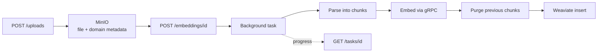

# Agentic RAG Service

An intelligent document processing and retrieval system using LangGraph, Weaviate, and Claude AI.

## Features

- **Document Processing**: Parse PDF and Markdown files
- **Domain Attribution**: Tag every chunk with the knowledge domain of its document
- **Idempotent Embedding**: Re-embedding a document replaces its chunks instead of duplicating them
- **Vector Search**: Store and retrieve document embeddings using Weaviate
- **External Embeddings**: EmbeddingGemma served over gRPC by the `rag-services` stack
- **Reranking**: Cross-encoder reranking of the retrieved candidates over gRPC, with
  graceful fallback to the retrieval order when the reranker service is unavailable
- **Agentic RAG**: Intelligent query processing with a LangGraph agent
- **Background Processing**: Async document processing with FastAPI background tasks
- **S3 Storage**: Store original documents in MinIO (S3-compatible)

Not implemented yet: DOCX parsing (`services/parsers.py`) and web scraping (`POST /scrappings`).

## Architecture

### Components

- **FastAPI**: REST API server
- **MinIO**: S3-compatible object storage for documents
- **Weaviate**: Vector database for embeddings, single collection `DefaultDocuments`
- **EmbeddingGemma (300M)**: Embedding generation over gRPC, 256 dimensions
- **Reranker service**: Cross-encoder reranking over gRPC, external service from the
  `rag-services` stack, optional (see Agent Workflow)
- **LangGraph**: Agent workflow orchestration
- **Claude**: LLM for answer generation, model chosen by `ANTHROPIC_MODEL`

### Ingestion Pipeline

Uploading is a two-step process: the file lands in storage first, embedding is a
separate background task tracked by its own task id.



### Agent Workflow

1. **Rephrase Query**: Reformulate the question for semantic search
2. **Embed Query**: Turn the rephrased question into a vector
3. **Retrieve**: Get top-k candidates from Weaviate (`INITIAL_RETRIEVAL_K`)
4. **Rerank**: Score the candidates against the query with the reranker service and
   keep the top `RERANK_TOP_K`. If the reranker service is unavailable or times out,
   this step logs a warning and falls back to the first `RERANK_TOP_K` candidates
   in retrieval order, so a missing reranker never fails the pipeline
5. **Generate**: Create an answer using Claude with the reranked context
6. **Evaluate**: Score the answer and iterate while it stays below the confidence threshold

### Chunking

| Format | Content types | Splitting | Sizes |
|---|---|---|---|
| PDF | `application/pdf` | per page, then `RecursiveCharacterTextSplitter` | `CHUNK_SIZE` / `CHUNK_OVERLAP` |
| Markdown | `text/markdown`, `text/plain` | per h1-h3 header, oversized sections split further | `MD_CHUNK_SIZE` / `MD_CHUNK_OVERLAP` |

Markdown chunks are built to survive retrieval on their own: YAML frontmatter is
dropped, every chunk is prefixed with the breadcrumb of its section (`H1 > H2`)
and `page` holds the section number. Markdown deliberately ignores the caller
supplied `chunk_size` and reads `MD_CHUNK_SIZE` from the settings, because header
scoped sections need a larger budget than a page slice. A chunk larger than 1500
characters is logged as a warning: the embedding service silently truncates
anything above 512 tokens.

## Prerequisites

- Docker and Docker Compose
- Python 3.13
- uv (Python package manager)

## Installation

1. **Install dependencies**:
   ```bash
   uv sync
   ```

2. **Set environment variables**:
   - Copy `env.example` and fill in `ANTHROPIC_API_KEY` and the MinIO credentials
   - `Settings` uses `extra="forbid"`, so a local `.env` must not contain the
     compose-only block of `env.example`

## Running the Application

### Using Docker Compose (Recommended)

```bash
docker compose up --build
```

This will start:
- FastAPI application on `http://localhost:8103`
- MinIO console on `http://localhost:9001`
- Weaviate on `http://localhost:8080`

The embedding service comes from the `rag-services` stack and joins over the
shared `arag-common-network` network.

### Local Development

```bash
# Ensure services are running (MinIO, Weaviate)
docker compose up minio weaviate -d

# Run the application
uv run fastapi dev src/docarag/main.py --host 0.0.0.0 --port 8103
```

## API Endpoints

### Health Check
```http
GET /health
```

### Upload Document
```http
POST /uploads
Content-Type: multipart/form-data

document_name: <name stored as document_name of every chunk>
document: <PDF or MD file>
domain: <slug, defaults to "general">
```

Either `document` or `document_url` must be provided, not both. `domain` must
match `^[a-z0-9][a-z0-9-]*$`. Keep `document_name` in latin characters: it
travels as an S3 metadata header.

### Generate Embeddings
```http
POST /embeddings/{file_id}
```

Starts a background task and returns its `task_id`. Chunks of the document that
are already in the vector database are purged before the new ones are written,
so running this twice does not duplicate vectors.

### Get Task Status
```http
GET /tasks/{task_id}
```

### Query Documents
```http
POST /query
Content-Type: application/json

{
  "query": "What is the main topic?",
  "max_iterations": 2
}
```

### List Documents
```http
GET /documents?page=1&page_size=10
```

### Delete Document
```http
DELETE /documents/{file_id}
```

Removes the objects from MinIO and every chunk embedded from them from Weaviate.

## Configuration

Settings are managed in `src/docarag/settings.py` using Pydantic Settings, see
`env.example` for the full list. Key options:

- `ANTHROPIC_API_KEY`: Claude API key
- `ANTHROPIC_MODEL`: Model name used by every agent node
- `EMBEDDING_SERVICE_URL`: gRPC endpoint of the embedding service
- `CHUNK_SIZE` / `CHUNK_OVERLAP`: PDF chunking (default: 512 / 64)
- `MD_CHUNK_SIZE` / `MD_CHUNK_OVERLAP`: Markdown chunking (default: 900 / 100)
- `INITIAL_RETRIEVAL_K`: Initial retrieval count (default: 20)
- `RERANKER_SERVICE_URL`: gRPC endpoint of the reranker service (default: `reranker-service:8352`)
- `RERANKER_TIMEOUT`: Reranker gRPC call timeout in seconds (default: 30)
- `RERANK_TOP_K`: Documents kept after reranking (default: 5)
- `AGENT_CONFIDENCE_THRESHOLD`: Score below which the agent iterates (default: 0.7)

## Testing

```bash
make tests
make linter
make typecheck
```

## Project Structure

```
src/docarag/
├── api.py                  # FastAPI endpoints
├── main.py                 # Entry point
├── settings.py             # Configuration
├── consts.py               # MIME types, collection name, domain rules
├── dependencies.py         # FastAPI dependencies
├── task_progress.py        # In-memory background task status
├── embedding_pb2.py        # Generated gRPC stubs of the embedding service
├── embedding_pb2_grpc.py
├── reranker_pb2.py         # Generated gRPC stubs of the reranker service
├── reranker_pb2_grpc.py
├── clients/                # External systems
│   ├── minio_client.py     # MinIO S3 client
│   ├── vector_db_client.py # Weaviate client
│   ├── embedding.py        # Embedding service gRPC client
│   └── reranker_client.py  # Reranker service gRPC client
├── models/                 # Pydantic models
│   ├── requests.py
│   ├── responses.py
│   └── upload.py
├── services/               # Core services
│   ├── uploader.py         # Upload flow and MIME detection
│   ├── parsers.py          # PDF and Markdown parsing
│   ├── embeddings.py       # Embedding service wrapper
│   ├── reranker.py         # Reranker service wrapper
│   ├── vector_db.py        # Weaviate collections and search
│   ├── agent.py            # LangGraph agent
│   ├── storage.py          # Not wired into the API
│   └── scraper.py          # Not wired into the API
├── tasks/
│   └── embedding_task.py   # Background embedding pipeline
└── utils/
    └── default_collection_conf.py  # Property layout of the collection
```

The gRPC stubs are generated ad-hoc and committed; regenerate them from `proto/`
with (pin `grpcio-tools`/`protobuf` to the versions locked in `uv.lock` for the
project's `grpcio`/`protobuf`, otherwise the generated gencode may require a
newer runtime than what is installed and fail to import):

```bash
uv run --with "grpcio-tools==1.78.0" --with "protobuf==6.33.6" python -m grpc_tools.protoc -I proto \
  --python_out=src/docarag --grpc_python_out=src/docarag proto/embedding.proto

uv run --with "grpcio-tools==1.78.0" --with "protobuf==6.33.6" python -m grpc_tools.protoc -I proto \
  --python_out=src/docarag --grpc_python_out=src/docarag proto/reranker.proto
```

Both generated `*_pb2_grpc.py` files import their sibling `*_pb2` module by the
project's full package path (e.g. `import src.docarag.reranker_pb2 as reranker__pb2`)
so they resolve under `src.docarag.*`; `protoc` emits a bare `import reranker_pb2`,
so that one import line needs a manual fix-up after regenerating.

`grpcio-tools` is pulled in on demand via `--with`, it is not part of the locked
dependencies; `protobuf` is locked (it is a transitive dependency of `grpcio`),
the `--with` pin above only keeps the ephemeral `protoc` run in sync with it.

## Development

### Code Quality

```bash
make formatter   # black + ruff format
make linter      # ruff check
make typecheck   # mypy
make security    # pysentry
```

## Usage Examples

### 1. Upload and embed a Markdown document

```bash
FILE_ID=$(curl -s -X POST "http://localhost:8103/uploads" \
  -F "document_name=internet-check-procedure.md" \
  -F "domain=diagnostics" \
  -F "document=@internet-check-procedure.md" | jq -r .file_id)

TASK_ID=$(curl -s -X POST "http://localhost:8103/embeddings/$FILE_ID" | jq -r .task_id)

curl -s "http://localhost:8103/tasks/$TASK_ID"
```

### 2. Query the Knowledge Base

```bash
curl -X POST "http://localhost:8103/query" \
  -H "Content-Type: application/json" \
  -d '{
    "query": "What are the main findings?",
    "max_iterations": 2
  }'
```

### 3. Delete a document

```bash
curl -X DELETE "http://localhost:8103/documents/$FILE_ID"
```

## Contributing

1. Follow PEP 8 style guidelines
2. Add tests for new features
3. Update documentation as needed
4. Use absolute imports: `from src.docarag.services import ...`

## License

MIT
